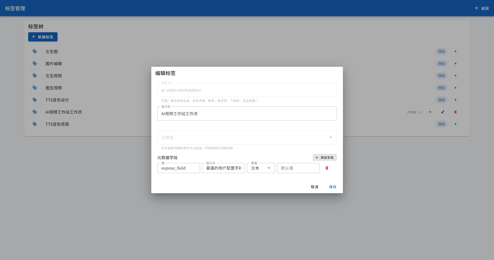

# ComfyUI Easy Bridge 对接配置说明

> 本文档配套 [bridge-workflow-fields.md](./bridge-workflow-fields.md)（工作流字段配置约定）使用：
> 本文档说明如何在 ComfyUI Easy Bridge 中完成「自动注册标签 → 标记工作流类型 → 配置对接字段」三步；
> 字段的命名、类型与文件 key 序号约定以字段约定文档为准。

## 步骤1：配置自动注册标签

在 `ai-video-workstation` 的`comfyui-bridge`提供商配置中，配置一个自定义的“工作流自动注册标签id”，如:`ai-video-workstation`

然后再到`ComfyUI Easy Bridge`的【标签管理】中，点击左上角【新增标签】按钮，创建一个标签id为前面自定义的标签id（如`ai-video-workstation`），显示名可以自定义，如：`AI视频工作站工作流`，父标签留空，并添加一个key为`expose_field`的标签元数据字段。

## 步骤2：标记工作流类型

在 `ComfyUI Easy Bridge` 配置页面操作

编辑工作流的标签，标记好各个工作流的类型以声明该工作流的能力。类型通过**预设标签 id** 识别，系统启动时会自动发现带这些标签的工作流并注册：

| 标签 id | 系统工作流类型 | 能力 |
| ----- | ------- | ----- |
| `text-to-image` | 文生图 | 文本 → 图片 |
| `image-edit` | 图片编辑 | 多图参考编辑 |
| `tts-voice-design` | TTS 音色设计 | 声线描述 + 朗读文本 → 音频 |
| `tts-voice-clone` | TTS 音色克隆 | 参考音频 → 音频 |
| `image-to-video` | 图生视频 | 图 / 视频 / 音频 → 视频 |

**图生视频**（`image-to-video`）还需通过**子标签**声明其支持的模式与能力：

| 子标签 id | 含义 |
| ----- | ------- |
| `reference` | 参考模式；可在该标签 metadata 中配置参考上限：`maxTotalCount` / `maxImageCount` / `maxVideoCount` / `maxAudioCount`（缺省 12 / 9 / 3 / 3） |
| `director` | 导演台模式（关键帧 + 混音） |
| `first-last-frame` | 首尾帧模式（2 帧） |
| `first-frame` | 首帧模式（1 帧） |
| `audio-input` / `audio-output` | 支持音频输入 / 音频输出 |

## 步骤3：配置工作流的对接约定字段

在 `ComfyUI Easy Bridge` 配置页面操作

不同类型的工作流需要根据以下约定配置字段，这样才能确保AI视频工作站能正确传递参数。各工作流在 Bridge 中的**工作流 id**、字段与文件 key 的完整约定见 [bridge-workflow-fields.md](./bridge-workflow-fields.md)，此处仅列出需要在 Bridge 中配置的字段别名与类型。

### 通用约定

- 提示词字段统一为 `prompt`
- 文件 key 序号统一 **0-based**：图片 `image_{n}`、视频 `video_{n}`、音频 `audio_{n}`；单音频用 `audio`
- 可选参数（`seed` 等）省略时不上送，由 Bridge / 引擎取默认

### 文生图 text-to-image

Bridge 工作流 id：`text_to_image`

| 字段别名 | 类型 | 含义 |
| ----- | ------- | ----- |
| `prompt` | text | 文生图提示词 |
| `width` | number | 输出图片宽度px |
| `height` | number | 输出图片高度px |
| `seed` | number（可选） | 随机种子 |

### 图片编辑 image-edit

Bridge 工作流 id：`qwen-edit-2509`

| 字段别名 | 类型 | 含义 |
| ----- | ------- | ----- |
| `prompt` | text | 编辑描述 |
| `image_0` / `image_1` / … | image | 输入参考图（多图动态 key，按数组顺序 0-based） |
| `seed` | number（可选） | 随机种子 |
| `width` | number（可选） | 指定输出宽度px（不指定则完全不带） |
| `height` | number（可选） | 指定输出高度px（不指定则完全不带） |

### TTS 音色设计 tts-voice-design

Bridge 工作流 id：`tts_voice_design`

| 字段别名 | 类型 | 含义 |
| ----- | ------- | ----- |
| `prompt` | text | 声线描述 |
| `text` | text | 朗读文本 |
| `seed` | number（可选） | 随机种子（固定 seed 稳定音色） |

### TTS 音色克隆 tts-voice-clone

| 字段别名 | 类型 | 含义 |
| ----- | ------- | ----- |
| `text` | text | 朗读文本 |
| `ref_text` | text | 参考音频的文字内容 |
| `audio_0` | audio | 参考音频 |
| `seed` | number（可选） | 随机种子 |

### 图生视频 image-to-video

时长上限 15s，按模式分三类：

#### 1. 参考模式（`minimax-h3-r2v`）

| 字段别名 | 类型 | 含义 |
| ----- | ------- | ----- |
| `prompt` | text | 视频描述提示词 |
| `width` | number | 输出宽度px |
| `height` | number | 输出高度px |
| `duration` | number | 视频时长（秒） |
| `image_{n}` | image | 图片参考（≤9） |
| `video_{n}` | video | 视频参考（≤3） |
| `audio_{n}` | audio | 音频参考（≤3，各类型总数 ≤12） |
| `seed` | number（可选） | 随机种子 |

> 音频参考不能作为唯一输入（须与图片 / 视频参考同传）。

#### 2. 首尾帧模式

**a. LTX-2.3（`I2V` / `FL2V` / `FML2V`，按帧数自动选择）**

| 帧数 | 工作流 | 文件 |
| ----- | ------- | ----- |
| 1 | `I2V` | `image_0` |
| 2 | `FL2V` | `image_0`、`image_1` |
| 3 | `FML2V` | `image_0`、`image_1`、`image_2`（另带 `mid_frame_cursor=0.5`） |

| 字段别名 | 类型 | 含义 |
| ----- | ------- | ----- |
| `prompt` | text | 视频描述提示词 |
| `width` | number | 输出宽度px |
| `height` | number | 输出高度px |
| `duration` | number | 视频时长（秒） |
| `fps` | number | 帧率 |
| `auto_generate_audio` | boolean | 自动生成音频（默认 true） |
| `audio` | audio（可选） | 背景音频（提供时 `auto_generate_audio` 置 false） |
| `seed` | number（可选） | 随机种子 |

**b. MiniMax H3（`minimax-h3-fl2v`，1~2 帧）**

| 字段别名 | 类型 | 含义 |
| ----- | ------- | ----- |
| `prompt` | text | 视频描述提示词 |
| `width` | number | 输出宽度px |
| `height` | number | 输出高度px |
| `duration` | number | 视频时长（秒） |
| `image_0` | image | 首帧（必填） |
| `image_1` | image（可选） | 尾帧 |
| `seed` | number（可选） | 随机种子 |

#### 3. 导演台模式（`ltx-2.3-director`）

| 字段别名 | 类型 | 含义 |
| ----- | ------- | ----- |
| `prompt` | text | 视频描述提示词 |
| `width` | number | 输出宽度px |
| `height` | number | 输出高度px |
| `duration` | number | 视频时长（秒） |
| `fps` | number | 帧率 |
| `auto_generate_audio` | boolean | 自动生成音频（默认 true） |
| `frame_define` | text | 关键帧定义 JSON 字符串（见下方说明） |
| `image_{frameSeq}` | image | 关键帧图（与 `frame_define` 中 `frameSeq` 一一对应） |
| `audio` | audio（可选） | 背景音频（提供时 `auto_generate_audio` 置 false） |
| `seed` | number（可选） | 随机种子 |

> `frame_define` 格式：`[{ frameSeq, cursor }]`，`frameSeq` 0-based（对应文件 `image_{frameSeq}`），`cursor` 为该帧在视频长度中的位置比值（0~1）。

## 附：expose_field 用户参数暴露

自动注册标签的元数据 `expose_field`（逗号分隔的字段别名列表）用于声明哪些字段作为**前端用户可配置参数**暴露。结构字段（`prompt` / `width` / `height` / `duration` / `fps` / `seed` / 文件 key 等）由工作站固定组装，无需列出；如需开放额外的可调参数（如 `enable_multiple_angles_lora`），将其别名加入 `expose_field` 即可。

## 附：ComfyUI 提供商选择

Easy Bridge 支持多个「执行提供商」实例（ComfyUI 原生 / RunningHub），并允许每次执行通过保留键 `providerId` 显式指定实例（见 Easy Bridge 的 `docs/workflow-api.md` §1/§2）。

工作站中**所有来自 ComfyUI Easy Bridge 的工作流**（`ceb-*`）在生成对话框 / 批量生成 / 画布节点编辑器的参数表单顶部都提供「ComfyUI 提供商」下拉：

- 选项实时来自 Easy Bridge 的 `GET /api/providers`（仅列出启用实例，RunningHub 类型带标注），**每次打开表单实时拉取，不缓存**；
- 选择实例 → 提交时以保留键 `providerId` 显式指定本次执行的实例（JSON 模式为请求体顶层字段，multipart 模式为独立表单字段，不进入 `params`）；
- 留空（默认）→ 不携带 `providerId`，由 Easy Bridge 按「工作流配置的提供商 → 系统全局默认提供商」解析；
- 所选实例被禁用或删除后，已保存的选择以禁用项回显，需重新选择；仍提交无效 ID 时 Easy Bridge 返回 `400 provider_not_configured`，任务失败并透出错误。

